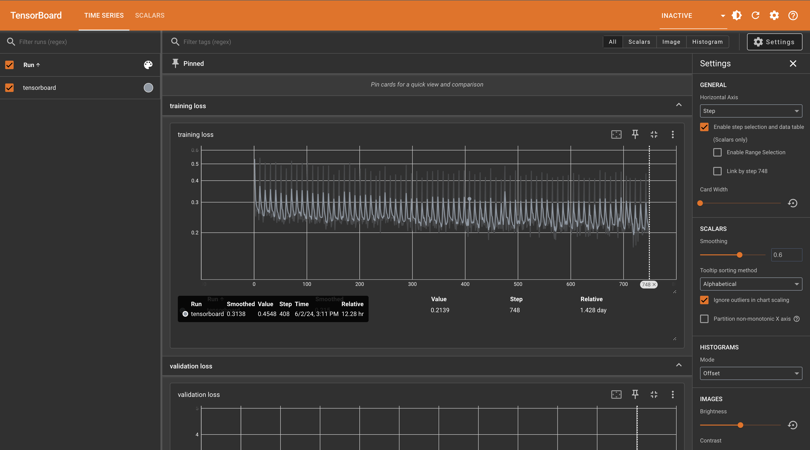

# Facebook Marketplace's Recommendation Ranking System

Facebook marketplace recommendation ranking system project 

## Table of Contents

1. [Description](#description)
2. [Installation](#installation)
3. [Usage](#usage)
4. [File Structure](#file-structure)
5. [TensorBoard Visualizations](#tensorboard-visualizations)
6. [License](#license)

## Description

The Facebook Marketplace is a platform for buying and selling products on Facebook. This project is an implementation of the system behind the marketplace, which uses AI to recommend the most relevant listings based on a personalised search query.
This project utilizes a pretrained ResNet-50 model to extract features from images. Initially, a classification model is trained using a custom dataset, and then the model is converted into a feature extraction model by removing the last few fully connected layers. The goal of this project is to understand the process of fine-tuning a pretrained model and using it for feature extraction.

### What It Does
- Trains a ResNet-50 model on a custom dataset.
- Converts the trained classification model into a feature extraction model.
- Processes images to extract feature vectors
- Logs training and validation metrics to TensorBoard.

### What You Learned
- How to train a classification model using PyTorch.
- How to fine-tune pretrained models.
- How to extract features from images using a trained model.
- How to use TensorBoard for visualizing training metrics.

## Installation

### Prerequisites
- Python 3.6+
- PyTorch
- TorchVision
- Pandas
- scikit-learn
- Pillow
- TensorBoard


### Instructions
1. Clone the repository:
```bash
git clone https://github.com/adebayopeter/facebook-marketplaces-recommendation-ranking-system619.git
```

2. Create a virtual environment
```bash
python -m venv venv
source venv/bin/activate # On windows use `venv\Scripts\activate`
```

3. Install the required packages:
```bash
pip install -r requirements.txt
```

4. Create data resource folders/files
Create a folder `data` that would serve as our main resource folder.
Inside `data` create a folder `csv` that holds the csv dataset of `Image.csv`, `Prodcts.csv`, `merged_data.csv` and `cleaned_images.csv`. 
Inside the folder, create `images` folder that holds the image dataset and `clean_images` folder where we store the cleaned images.

## File Structure
The project directory is structured as follows:

```
📦 facebook_markeplace
├─ data
│  ├─ csv
│  │  ├─ Products.csv
│  │  ├─ training_data.csv
│  │  ├─ merged_data.csv
│  │  └─ cleaned_images.csv
│  ├─ clean_images
│  ├─ images
│  ├─ model_evaluation
│  └─ resource
│     ├─ tensorboard
│     └─ image_decorder.pkl
├─ .gitignore
├─ clean_images.py
├─ clean_tabular_data.py
├─ image_processor.py
├─ main.py
├─ model.py
├─ README.md
└─ requirements.txt
```

## TensorBoard Visualizations

### Training and Validation Loss


## License
This project is licensed under [](https://opensource.org/licenses/MIT)